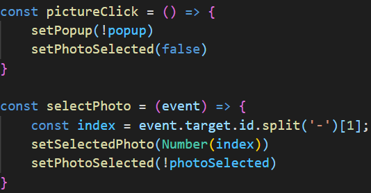

# Petential Places #
[Documentation](./documentation)

[Live Site](https://petential-places.herokuapp.com/)

## About ##
Petential places is a full stack clone of Yelp that focuses on tracking reviews for businesses with pets. Key features of the site include the ability to search for businesses by name and/or location, write reviews, upload and explore pictures of a business, and create new businesses. Currently all seeder data is for Baltimore, MD so if you want to search up some funny pet-themed businesses, be sure to look here.

## Installation ##
1. Clone the GitHub repository.
2. Run ***npm install*** in the base directory.
3. Create a database user with your desired password using PostgreSQL.
4. Create an AWS IAM user and public Bucket with permissions granted to the IAM user.
5. cd into the backend directory.
6. Create a .env file using the guidelines of the example.env file, adding in the information from the previous two steps.
7. Run ***npx sequelize-cli db:create***.
8. Run ***npx sequelize-cli db:migrate***.
9. Run ***npx sequelize-cli db:seed:all***.
10. To start the server run ***npm start*** in both the frontend and backend folders.

## Technologies Used ##
Petential places uses various technologies to create a dynamic and fun web application. The front end utilizes React and Redux while the back end relies on Express, Sequelize and PostgreSQL. Other key technologies include AWS for image uploading and the TomTom Maps API for displaying map information.

## Key Features ##

### Image Uploading ###
One of the most important features of a review site like Yelp and Petential places is the capability for users to upload images. When adding an image to a review or business, users are able to add a link to an existing picture or upload an image from their local computer. Petential Places allows for this through the use of AWS. Upon selecting the upload image button, users are permitted to select a png, jpeg, or gif file to upload. After making this selection, the image file is incorporated into a FormData object which is then sent to the backend server via an HTTP POST request. The Express server then converts this image into base64 and uploads it to AWS using a unique identifier as its name. This implementation allows for seamless image uploading and a snappy user experience.

***A demonstration of the image uploading feature from the user's perspective.***

***A code snippet from Petential Places that opens up the local device image upload window.***

### Image Viewing ###
Uploading images would not serve much of a purpose if they could not be viewed afterwards. As such, one of the most important features of Petential Places is the image viewing modal. This dynamic feature allows for users to browse through all of the images posted for a business or choose to focus on one at a time to see additional information. All of this is handled through fetching the image data from the backend, storing it in Redux, and changing what is displayed using React state.

***A demonstration of the image browsing modal from the user's perspective.***

***A code snippet that toggles the image modal display mode.***

## Challenges ##
There were numerous challenges in the development of Petential Places that had to be addressed along the way. One of the most interesting issues was how to effectively display a business' location. The solution for this came in the form of the TomTom Maps API. This technology was selected for its dynamism and the ease with which a product key could be obtained. One central issue with weaving this API into the application, came in ensuring that the maps would not load before receiving coordinate data from the server. This was accomplished via using React state to prevent display of the map until a response had been received from the server.

Perhaps the most fun challenge in the project was creating a seeder data generator. This script involved selecting a random business name via a combination of a pet-related adjective and a business type. Following this, a randomized location, cat breed, and street name were all generated. A randomized number of reviews were then created for the business using a similar method. Each review also could contain up to five photos which were pulled from The Cat API based on the breed of cat associated with the business. All of this data was output into a JSON file which could then be integrated into the database.
