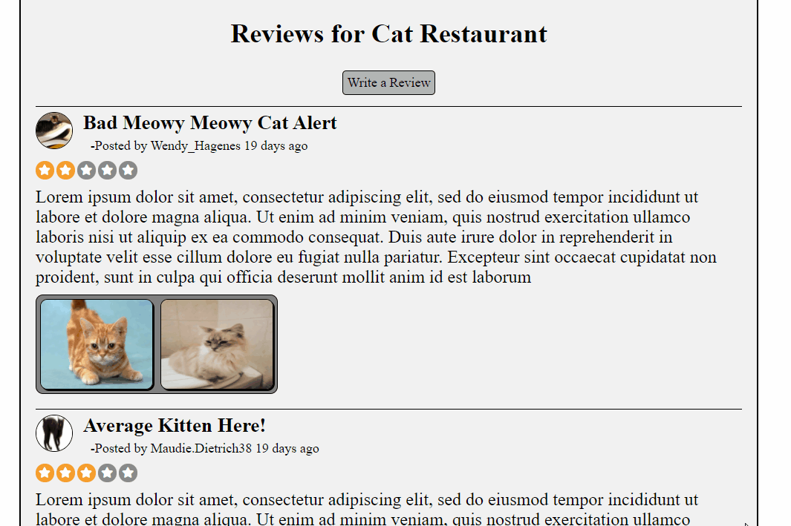
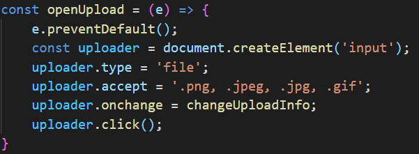

# Petential Places #

## About ##
Petential places is a full stack clone of Yelp that focuses on tracking reviews for businesses with pets. Key features of the site include the ability to search for businesses by name and/or location, write reviews, upload and explore pictures of a business, and create new businesses. Currently all seeder data is for Baltimore, MD so if you want to search up some funny pet-themed businesses, be sure to look here.

## Technologies Used ##
Petential places uses various technologies to create a dynamic and fun web application. The front end utilizes React and Redux while the backend relies on Express, Sequelize and PostgreSQL. Other key technologies include AWS for image uploading and the TomTom Maps API for displaying map information.

## Key Features ##

### Image Uploading ###
One of the most important features of a review site like Yelp and Petential places is the capability for users to upload images. When adding an image to a review or business, users are able to add a link to an existing picture or upload an image from their local computer. Petential Places allows for this through the use of AWS. Upon selecting the upload image button, users are permitted to select a png, jpeg, or gif file to upload. After making this selection, the image file is incorporated into a FormData object which is then sent to the backend server via an HTTP request. The Express server then converts this image into base64 and uploads it to AWS using a unique identifier as its name. This implementation allows for seamless image uploading and a snappy user experience.

A demonstration of the image uploading feature from the user's perspective.

A code snippet from Petential Places that opens up the local device image upload window.

### Image Viewing ###
Uploading images would not serve much of a purpose if they could not be viewed afterwards. As such, one of the most important features of Petential Places is the image viewing modal. This dynamic feature allows for users to browse through all of the images posted for a business or choose to focus on one at a time to see additional information. All of this is handled through fetching the image data from the backend, storing it in Redux, and changing what is displayed using React state.

A demonstration of the image browsing modal from the user's perspective.
